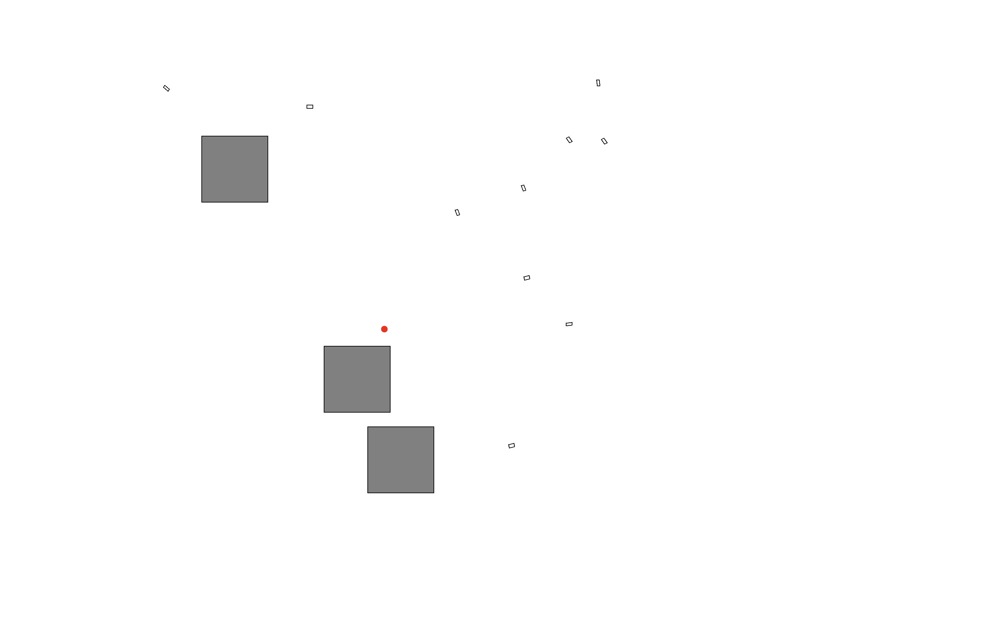

## Features & Logic

### 1. Swarm Intelligence (Boids Model)

Each vehicle operates based on three local rules:

- **Separation**: Maintains a personal space to avoid collisions with neighbors.
- **Alignment**: Adjusts heading to match the average direction of the local flock.
- **Cohesion**: Steers toward the average position (center of mass) of nearby vehicles.

### 2. Foraging & Targeting

- **Target Spawning**: Targets appear at random locations within the vehicle's reachable bounds, avoiding obstacle footprints.
- **Consumption**: When the swarm reaches a target, they congregate for **3 seconds**. During this phase, "Alignment" forces are suppressed to allow vehicles to stop and gather.
- **Dispersal Phase**: After a target is consumed, the swarm enters a **2-second dispersal state**, moving randomly to prevent clumping before the next target spawns.

### 3. Navigation & Obstacles

- **Obstacle Avoidance**: Vehicles use an exponential "push-away" force to steer clear of gray obstacles.
- **Reflective Boundaries**: The simulation uses a boundary box where vehicles bounce off the edges to remain within the visible window.

## Project Structure

- `Simulation.java`: The application entry point. Manages the simulation loop, target lifecycle, and obstacle generation.
- `Canvas.java`: Handles the rendering of rotated vehicle polygons, static obstacles, and the dynamic target.
- `Vehicle.java`: Contains the core behavior logic, including steering weights and physical movement updates.
- `Obstacle.java`: Represents the static box obstacles with configurable dimensions.
- `VectorCalculation.java`: A utility class for 2D vector math, normalization, and truncation.

---

**Note:** The simulation uses a coordinate scaling factor (`pix`) to map world physics to screen pixelsThis updated README expands on your project's logic, including the specific swarm intelligence principles and the "foraging" mechanics you implemented.

---

# SwarmSimulation

SwarmSimulation is a Java Swing-based project that simulates emergent behavior through a swarm of autonomous vehicles. The simulation demonstrates complex group dynamics as vehicles navigate around obstacles to "forage" for dynamic targets using Swarm Intelligence principles.

## Screenshot



## Requirements

- **Java 21**
- **Maven 3.9+**

## Run

From the project root:

```bash
mvn clean package
java -cp target/classes com.dgx.Simulation
```
